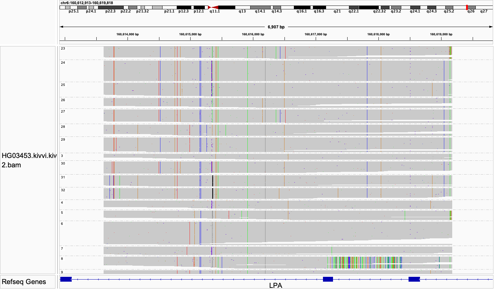

# Kivvi: HiFi genotyper for large-unit variable number tandem repeat

Kivvi is a HiFi-based tool that calls the copy number and sequence variants of large-unit variable number tandem repeats (VNTRs). With the large size of the full repeat and the highly polymorphic nature across individuals, these regions are challenging to resolve using currently available methods. Kivvi identifies unique copies of each repeat and assembles them into alleles. Kivvi has been applied to two medically important VNTRs.
- The LPA Kringle IV-type 2 (KIV2) repeat (repeat unit 5.5kb). A short KIV2 allele is associated with a higher risk of cardiovascular diseases.
- The D4Z4 repeat (repeat unit 3.3kb). A contracted D4Z4 allele causes FSHD1 (Facioscapulohumeral Muscular Dystrophy, Type 1) via ectopic expression of the DUX4 gene.

# Table of Contents
1. [LPA Kringle IV-type 2 (KIV2) repeat](#lpa-kringle-iv-type-2-kiv2-repeat)
    - [Input](#input)
    - [Running the program](#running-the-program)
    - [Output](#output)
    - [Examples and visualization](#examples-and-visualization)
2. [D4Z4 repeat](#d4z4-repeat)
    - [Running the program](#running-the-program-1)
    - [Output](#output-1)
    - [Examples and visualization](#examples-and-visualization-1)


## LPA Kringle IV-type 2 (KIV2) repeat

### Input 
WGS bam (aligned to GRCh38)

Note that the input data must be standard depth WGS (~30X or higher), with an average read length of 10kb or higher. Targeted data is not supported due to the shorter read length.

Kivvi can also take a bamlet of the region as input. Please extract `chr6:160605000-160655000` from the WGS BAM. 

### Running the program
Kivvi requires a genome-aligned BAM, a FASTA file for the genome that the BAM is aligned to, an output directory and a prefix to output files.
```bash
kivvi -b $WGS_BAM -o $OUTPUT_DIRECTORY -p $OUTPUT_PREFIX -r $GENOME_FASTA kiv2
```

Kivvi is single-threaded and generally takes less than 5 minutes per sample.

### Output
- `$prefix.kivvi.kiv2.json`: reports allele and variant information for each sample
- `$prefix.kivvi.kiv2.bam`: all KIV2 reads realigned to one repeat unit on GRCh38 (`chr6:160613619-160619170`). Can be loaded into IGV to view different repeat copies. (Group by HP tag)
- `$prefix.kivvi.kiv2.vcf`: small variants called on each assembled allele, reported using the genome coordinate of one copy of the repeat on GRCh38 (`chr6:160613619-160619170`).
- `$prefix.kivvi.kiv2.svg`: reads plotted onto assembled alleles for visualization. (Only produced when at least one allele is assembled)

### Examples and visualization

Take sample HG03453 as an example. Raw WGS data can be downloaded from `s3://human-pangenomics/working/HPRC/HG03453/raw_data/PacBio_HiFi/`. A WGS BAM could be generated by aligning the HiFi reads against GRCh38. A bamlet of the region for this sample is available [here](example/HG03453_kiv2_extract.bam).

After running Kivvi, the `.json` output file contains copy number calls in the `allele_cn` field. It reports the copy number of both alleles as `#/#` if both alleles are assembled. If only one allele is assembled, `allele_cn`  reports one number. It’s empty when zero allele is assembled. 

```json
{
  "allele_cn": "14/23",
  "complete_alleles": [
    "LeftFlank-10-13-11-8-3-8-12-3-3-6-9-4-5-7-RightFlank",
    "LeftFlank-25-24-1-2-23-31-14-32-27-33-15-17-21-22-21-29-26-19-30-27-18-28-16-RightFlank"
  ],
}
```

The output `.bam` file can be loaded into IGV. Reads are grouped into unique KIV2 copies (which we term "fingerprints").



The output `.svg` file can visualize the assembled alleles and help check how well the alleles are supported by reads.

The first row of each panel shows the allele, followed by reads that support the allele. The repeat number is labeled on the allele. Upstream and downstream flanks are shown by the teal rectangles. The bases of alleles and reads are plotted at positions that have variants within the repeat unit in a sample, i.e. only a subset of positions in the 5.5kb repeat unit are plotted. Variant bases are shown as black, reference bases are shown as yellow, and magenta represents other bases or missing information such as deleted bases or low base quality bases.

In this sample, the first repeat copy of the first allele is rich in variants at plotted sites. This is fingerprint #10 in the `.bam` IGV image shown above, where we could see the cluster of mismatches towards the right half of the repeat unit. This cluster of variants marks a subtype of KIV2, which is often located in the first few repeat units of a KIV2 allele.


The figure below shows a second example, using a Platinum Pedigree sample NA12885.

The red-underlined reads here mark non-uniquely supporting reads. All reads without the underline are uniquely supporting an allele. The two alleles in this sample share two fingerprints in the middle and another two fingerprints at the end, so there are some reads that are consistent with both alleles and they are randomly plotted in this plot.


## D4Z4 repeat

The D4Z4 repeat exists on both chr4 and chr10, while a contracted D4Z4 allele is only pathogenic on a specific haplotype (qA, with intact PolyA site) on chr4 (and when hypomethylated). Kivvi collects D4Z4 reads from both chromosomes and assembles them, and determines the chromosome backgrounds of each assembled allele. D4Z4 alleles can be very long (1-100 copies, 3.3kb each). Longer alleles are difficult to assemble. Kivvi is designed to assemble most, if not all, of those short alleles which are the pathogenic ones (10 copies or less). As we expect 4 alleles in total (chr4 and chr10), Kivvi can report 0-4 alleles for a sample. If no alleles are assembled, it is likely that all alleles in the sample are long and thus not pathogenic.

In addition to information output by the KIV2 module, for each assembled D4Z4 allele, Kivvi determines the methylation status and the chromosome background. 

### Running the program
Similar to running KIV2.
```bash
kivvi -b $WGS_BAM -o $OUTPUT_DIRECTORY -p $OUTPUT_PREFIX -r $GENOME_FASTA d4z4
```

Kivvi can also take a bamlet of the region as input. Please extract `chr4:190022510-190093263 chr4:190173122-190175603 chr10:133622567-133685491 chr10:133740609-133761680` from the WGS BAM. 

### Output
Similar to running KIV2.
- `$prefix.kivvi.d4z4.json`: reports allele and variant information for each sample
- `$prefix.kivvi.d4z4.bam`: all D4Z4 reads (from both chr4 and chr10) realigned to one repeat unit (the D4Z4 repeat is noisy on GRCh38, so a different [reference](data/d4z4/d4z4_ref.fa) is used). Can be loaded into IGV (using the provided [reference](data/d4z4/d4z4_ref.fa)) to view different repeat copies. (Group by HP tag)
- `$prefix.kivvi.d4z4.vcf`: small variants called on each assembled allele, reported using coordinate on the provided [reference](data/d4z4/d4z4_ref.fa).
- `$prefix.kivvi.d4z4.svg`: reads plotted onto assembled alleles for visualization. (Only produced when at least one allele is assembled)

In addition, Kivvi generates
- `$prefix.kivvi.d4z4.methyl.svg`: reads plotted onto assembled alleles for visualization of the methylation level. (Only produced when at least one allele is assembled)

### Examples and visualization

Take the same sample HG03453 as an example. A bamlet of the region for this sample is available [here](example/HG03453_d4z4_extract.bam).

Kivvi assembles three alleles (the remaining allele is too long to be assembled accurately. Note that long alleles are not medically relevant).

Assembled alleles


Visualizing the methylation levels. Kivvi uses a set of 101 pre-selected CpG sites in the D4Z4 repeat unit for methylation analysis. Only those sites are plotted.


The JSON file reports the copy number of assembled alleles with `allele_cn` (comma separated). In addition, the `haplotype_background` field under `additional` reports the chromosome/haplotype background of the assembled alleles, in the format of `x-y` (`x` can be `qAIntactPolyA`, or `qADisruptedPolyA` or `qB`, and `y` can be `chr4` or `chr10`). `qAIntactPolyA-chr4` alleles with a copy number of 10 or less and with a low methylation level are candidates for pathogenic alleles. Studies have shown that carriers of 1-6 D4Z4 units are more severely affected, whereas carriers of a 7-10 unit allele may show more clinical variability and non-penetrance. 


```json
{
  "allele_cn": "25,35,28",
  "complete_alleles": [
    "LeftFlank-64-62-57-63-48-58-52-52.1-52-52-48.1-50-52.2-48.2-48.3-52-48.4-35-35-35-37-35-48.5-48.6-59-RightFlank",
    "LeftFlank-46-78-77-77-71-72-21-77.1-21.1-21.2-80-27-1-26-76-74-75-73-28-31-32-32.1-32.2-33-25-23-25-23.1-23.2-23-23.3-24-23.4-23.5-22-RightFlank",
    "LeftFlank-19-10-10-12-18-17-13-10-14-14-8-5-5-6-7-6-9-6-16-10-10-6-4-3-15-4.1-4.2-2-RightFlank"
  ],
  "additional": {
    "haplotype_background": {
      "LeftFlank-19-10-10-12-18-17-13-10-14-14-8-5-5-6-7-6-9-6-16-10-10-6-4-3-15-4.1-4.2-2-RightFlank": "qAIntactPolyA-chr4",
      "LeftFlank-46-78-77-77-71-72-21-77.1-21.1-21.2-80-27-1-26-76-74-75-73-28-31-32-32.1-32.2-33-25-23-25-23.1-23.2-23-23.3-24-23.4-23.5-22-RightFlank": "qAIntactPolyA-chr4",
      "LeftFlank-64-62-57-63-48-58-52-52.1-52-52-48.1-50-52.2-48.2-48.3-52-48.4-35-35-35-37-35-48.5-48.6-59-RightFlank": "qADisruptedPolyA-chr10"
    },
  },
}
```

In the `methylation` section of the JSON, Kivvi reports the methylation levels of each assembled allele. 
- The `allele_methyl_median` field reports the median methylation level of each repeat unit on each assembled allele (each repeat unit has a value). 
- The `allele_fps_methyl_value` reports the methylation level of each CpG site (which is the median of values across supporting reads overlapping the CpG site) on each assembled allele. Kivvi uses a set of 101 pre-selected CpG sites in the D4Z4 repeat unit for methylation analysis, so there are `repeat copy number * 101` values reported for each assembled alleles.
