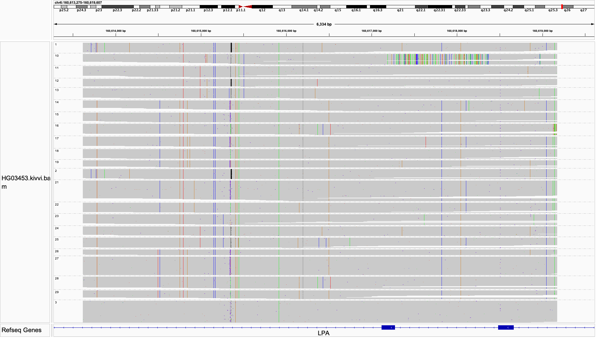
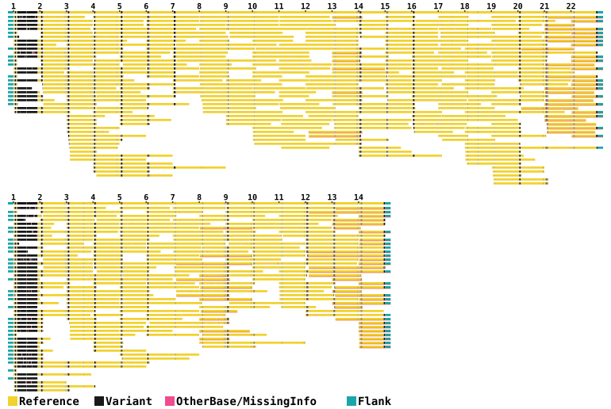
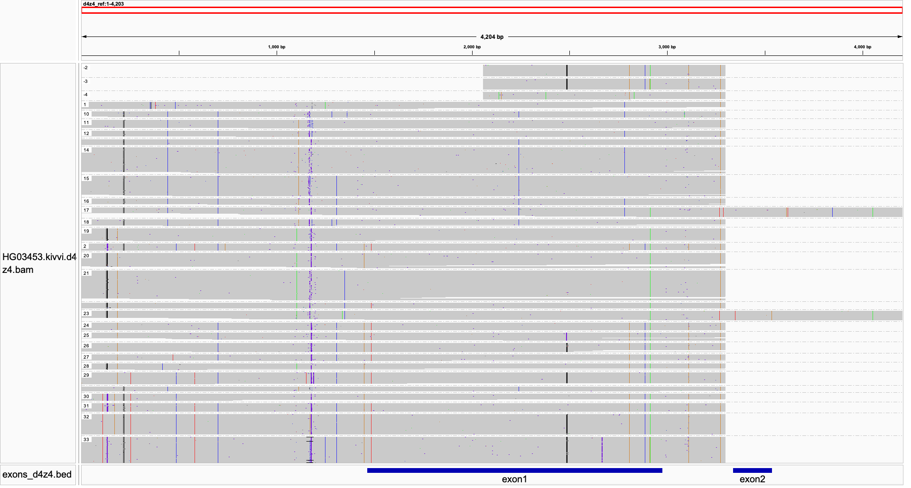

# Visualizing Kivvi results

## LPA Kringle IV-type 2 (KIV2) repeat

The Kivvi output `.bam` file can be loaded into IGV (navigate to `chr6:160613619-160619170` on GRCh38 and group alignments by `HP` tag). Reads are grouped into unique copies of the repeat unit, defined by a unique combination of small variants. These unique repeat units are labeled with different indices.

The unique repeat units are then assembled into alleles. The output `.svg` file can visualize the assembled alleles and help check how well the alleles are supported by reads.

The first row of each panel shows the allele, followed by reads that support the allele. The repeat number is labeled on the allele. HG03453 (see [demo](../README.md#demo-and-tutorials)) has 14 units on one allele and 23 units on the other allele. Upstream and downstream flanks are shown by the teal rectangles. The bases of alleles and reads are plotted at positions that have variants within the repeat unit in a sample, i.e. only a subset of positions in the 5.5kb repeat unit are plotted. Variant bases are shown as black, reference bases are shown as yellow, and magenta represents other bases or missing information such as deleted bases or low base quality bases.

In HG03453, the first repeat copy of the first allele is rich in variants at plotted sites. This is repeat unit #8 in the `.bam` IGV image shown above, where we could see the cluster of mismatches towards the right half of the repeat unit. This cluster of variants marks a subtype of KIV2, which is often located in the first few repeat units of a KIV2 allele.

The figure below shows a second example, using a Platinum Pedigree sample NA12885.

The red-underlined reads here mark non-uniquely supporting reads. All reads without the underline are uniquely supporting an allele. The two alleles in this sample share two repeat units in the middle and another two repeat units at the end, so there are some reads that are consistent with both alleles and they are randomly plotted in this plot.

## D4Z4

The Kivvi output `.bam` file can be loaded into IGV using the provided [reference](../data/d4z4/d4z4_ref.fa), which consists of one repeat unit, followed by a short sequence of the unique region downstream of D4Z4, which contains the polyA signal (in Exon 2 of the DUX4 gene).

Kivvi assembles three complete D4Z4 alleles for HG03453. See the [JSON](json.md) tutorial for more details and additional reporting of the fourth, partial allele.

